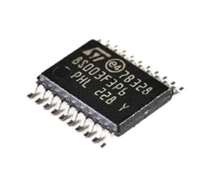
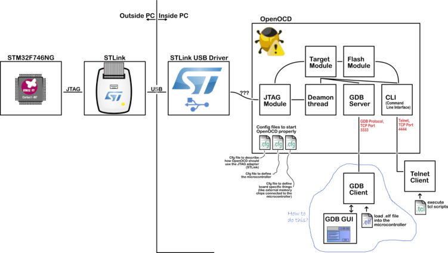
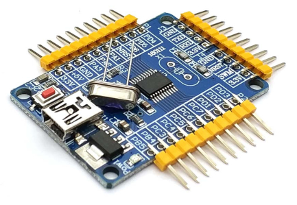

# Getting started with STM8 Development Tools on GNU/LINUX

> This guide was written for (and on) **Arch Linux** and **Ubuntu Linux**. I have not tested the procedure on other Linux architectures or distros, Users of other distros may find that some of the instructions don't work verbatim. Adapt as needed.



## Introduction

STM8 Series of micro-controllers by ST Microelectronics are dirt cheap and powerful at the same time. Their processing power is nothing short as of Arduino, while at the same time their power consumption is much less. These properties makes STM8 micros a great choice for many hobby and serious projects. This tutorial you will learn how to setup a developing and programming environment for STM8 on Linux based systems.

Here are the required tools that I used in this tutorial:

- **VS-Code** ( Visual Studio Code ) advanced text editor.
- **SDCC** Compiler v3.5.0 or higher.
- **STM8 Standard Peripherals Library**[^SPL], patched for SDCC. 
- **STM8-GDB / OPENOCD** for debugging.
- **ST-LINK / STM8FLASH** to write your compiled code into the micro-controller.
- **ST’s STM8 Evaluation board** or you can get away with el-cheapo chinese boards which are going for around 2$ including shipping!.


## Prepare required tools

### Install VS-Code

[Visual Studio Code](https://code.visualstudio.com/) is a cross-platform, free and open-source (licensed under the MIT License) text editor developed by Microsoft and is extensible using extensions, which can be browsed from within the text editor itself (via its extension gallery) or from <https://marketplace.visualstudio.com/VSCode>. While open-source, a proprietary build (licensed under an End-User License Agreement) provided by Microsoft is available and used as the basis for the [visual-studio-code-bin](https://aur.archlinux.org/packages/visual-studio-code-bin/) [^AUR] package (for an explanation of the mixed licensing, see this GitHub [comment](https://github.com/Microsoft/vscode/issues/60#issuecomment-161792005)).

**Installation**

```shell
# Arch linux
$ sudo pacman -S community/code

# Ubuntu linux 
$ wget https://go.microsoft.com/fwlink/?LinkID=760868
$ sudo dpkg -i code_1.27.1-1536226049_amd64.deb
```

**Usege**

```shell
$ code
```

**Add extention** 

press ( Ctrl + Shift + X ) then search and install the folowing extention:

- C/C++ for Visual Studio Code
- C++ Intellisense 
- hexdump for VSCode 
- vscode-devdocs


### Install SDCC

Install SDCC directly from AUR repository.

```shell
# download the latest version
$ wget https://downloads.sourceforge.net/project/sdcc/snapshot_builds/amd64-unknown-linux2.5/sdcc-snapshot-amd64-unknown-linux2.5-20180908-10537.tar.bz2
$ tar -xjf ./sdcc-snapshot-amd64-unknown-linux2.5-20180908-10537.tar.bz2
$ cd sdcc
$ sudo cp -r * /usr/local
```

> [SDCC](http://sdcc.sourceforge.net) SourceForge
>
> Documentation SDCC Manual [PDF](http://sdcc.sourceforge.net/doc/sdccman.pdf)

### Download STM8 Standard Peripherals Library [^SPL]

SDCC supports STM8, but for licensing reasons (booo, ST!), the [Standard Peripheral Library (SPL)](https://my.st.com/content/my_st_com/en/products/embedded-software/mcus-embedded-software/stm8-embedded-software/stsw-stm8069.html) is missing.

Someone developed a patch that makes the SPL compatible with SDCC, available here: [SPL_2.2.0_SDCC_patch](https://github.com/gicking/SPL_2.2.0_SDCC_patch). There's an AUR package that attempts to install it in the SDCC libraries folder ([aur/stm8-spl-sdcc](https://aur.archlinux.org/packages/stm8-spl-sdcc/)), but alas the zip with the SPL files is login & EULA-click protected (booo again, ST!).


### GDB Debugger



GDB offers extensive facilities for tracing and altering the execution of programs. The user can monitor and modify the values of programs' internal variables, and even call functions independently of the program's normal behavior.

#### OpenOCD

Install **openocd** from **aur/openocd-git** for latest update to use **STM8** devices   

```shell
# Arch linux 
$ sudo pacman -S community/openocd

# Ubuntu linux 
$ sudo apt install openocd
```

> SourceForge [OpenOCD](http://openocd.org).

#### STM8-GDB

Download [stm8 binutils-gsb](https://sourceforge.net/projects/stm8-binutils-gdb/files/stm8-binutils-gdb-sources-2018-03-04.tar.gz/download) sources.

Building the binaries is basically the process of downloading the sources and applying the patches. There are helper scripts to assist with the process.

Also note you need some libraries for TUI mode to work. Among those are ncursesw.

First set your installation directory if you want it in a specific location. Otherwise skip this step to keep the default (/usr/local).

export PREFIX=<path>

To download, patch and configure:

```shell
$ ./patch_binutils.sh
$ ./configure_binutils.sh
```

Next step is the regular building and install:

```shell
$ cd binutils-2.30
$ make
$ sudo make install
```

> SourceForge [stm8-binutils-gdb](https://stm8-binutils-gdb.sourceforge.io).

### Programmer


#### ST-Link


ST-Link programmer or clone used to write your compiled code ( Firmware ) into the micro-controller.
For the programmer, you need one that support SWIM (Single Wire Interface Module) mode. You can (recommended) go with the original debugger of STMicroelectronics which is ST-Link V2 (you can get this one second hand as low as 20$) or if you are really want to go economical, you can get away with the fake ones wich cost you under 10$ (please note that these cheap debuggers only support software mode, which works fine, and do not give you full functionality and speed of the genuine debuggers of ST itself). or you can build your own Open source Stlink Tools.

> ST-LINK/V2-1 firmware upgrade [STSW-LINK007](https://www.st.com/en/development-tools/stsw-link007.html). 
>
> Open source version of the STMicroelectronics Stlink Tools [here](https://github.com/texane/stlink) 
>
> Black Magic Probe, Open Source JTAG & SWD GNU Debugger and Programmer [here](https://github.com/blacksphere/blackmagic/wiki) and [here](https://embdev.net/articles/STM_Discovery_as_Black_Magic_Probe)

#### udev
Linux users have to install udev rules for supported st-link programmer.

```shell
sudo nano /etc/udev/rules.d/49-stlink.rules

# STLink v1
ATTRS{idVendor}=="0483", ATTRS{idProduct}=="3744", MODE="0666"

# STLink v2
ATTRS{idVendor}=="0483", ATTRS{idProduct}=="3748", MODE="0666"

# STLink v2-1
ATTRS{idVendor}=="0483", ATTRS{idProduct}=="374b", MODE="0666"
ATTRS{idVendor}=="0483", ATTRS{idProduct}=="3752", MODE="0666"

# STLink v3 in usbloader mode and standard (debug) mode
ATTRS{idVendor}=="0483", ATTRS{idProduct}=="374d", MODE="0666"
ATTRS{idVendor}=="0483", ATTRS{idProduct}=="374e", MODE="0666"
ATTRS{idVendor}=="0483", ATTRS{idProduct}=="374f", MODE="0666"
ATTRS{idVendor}=="0483", ATTRS{idProduct}=="3753", MODE="0666"
```
save and exit, then reload udevadm
```shell
$ sudo udevadm control --reload-rules && sudo udevadm trigger
```

Ubuntu/Debian users may need to add own “username” to the “dialout” group if they are not “root”, doing this issuing
```shell
sudo usermod -a -G dialout $USER
sudo usermod -a -G plugdev $USER
```
Arch users may need to add their user to the “uucp” group
```shell
$ sudo usermod -a -G uucp $USER
$ sudo usermod -a -G lock $USER
```

#### STM8FLASH

it was the only program that's able to communicate through the SWIM interface of ST-LINKs to upload compiled code ( Firmware ) into the micro-controller.

Install **stm8flash** from [^AUR]  package

```shell
## Arch linux 
$ yaourt -S aur/stm8flash-git

## Ubuntu linux
## Install from src git repo
$ git clone https://github.com/vdudouyt/stm8flash.git
$ cd stm8flash
$ make
$ sudo make install
```

> GitHub opensource software distributed on [vdudouyt/stm8flash](https://github.com/vdudouyt/stm8flash)


### ST’s STM8 Discovery

The STM8S-DISCOVERY helps you to discover the STM8S features and to develop and share your own application. In my case i use STM8S003F3P6 STM8S Minimum System Development Board Module. It's about $1-$5 from [AliExpress](https://www.aliexpress.com/item/New-STM8S003F3P6-STM8S-Minimum-System-Development-Board-Module-SWIM-Debug-20pin/32844169947.html) 




## Get Started

### Your first code </>

Usually the first step toward learning development on a micro-controller is  simply blinking a LED, as an analog to “Hello, world!” example used on PC programming languages. This time we will have a look into how to start programming and development on STMicroelectronics STM8 series of micro-controllers.

At this point you should have a working dev environment and can start experimenting with the board.

[STM8S Reference Manual](https://www.st.com/content/ccc/resource/technical/document/reference_manual/9a/1b/85/07/ca/eb/4f/dd/CD00190271.pdf/files/CD00190271.pdf/jcr:content/translations/en.CD00190271.pdf) 

**stm8_blinky.c**

```c
#include "stm8l.h"
int main() 
{
   int d,c;
   // Configure pins
   PD_DDR = 0x01;
   PD_CR1 = 0x01;
   // Loop
   do {
        PD_ODR ^= 0x01;
        for(d = 0; d<19000; d++) 
        { 
           for(c = 0; c<5; c++) ;
        }
      } while(1);
}
```


### Build code  

```shell
$ sdcc -lstm8 -mstm8 --opt-code-size --std-sdcc99 --nogcse --all-callee-saves --debug --verbose --stack-auto --fverbose-asm --float-reent --no-peep -I./ -I./STM8S_StdPeriph_Driver/inc -D STM8S003 ./stm8_blinky.c
```


### Wiring it up

Out of the factory, each board is flashed with a blinking demo, so you should see it start blinking as soon as you connect the USB. We won't be using the USB though, so unplugit again and prepare your ST-Link and the connection cable that came with it.

You'll also need to solder some headers to your STM8 board, at the very least the programming header (opposite of the USB). Both the dongle pins and the programming header are clearly labeled, so you shouldn't have any issues.

> If you use clone st-link programmer, don't connect the 3V3 line from the dongle to the board *while powering the board from USB*. Technically nothing bad should happen, but you're connecting two LDOs in parallel and that's just a bad idea.
>
> Simply leave the 3V3 pin of the programming header unconnected in this case.


### First-time wipe

The board should start blinking immediately. The first step though will be to wipe the chip, since the factory-loaded firmware is read-protected and you can't do anything while it's locked down.

To unlock the chip, use the `-u` flasher option (for more info, run `stm8flash -h`):

```shell
$ stm8flash -c stlinkv2 -p stm8s003f3 -u
Determine OPT area
Unlocked device. Option bytes reset to default state.
Bytes written: 11
```

The board will stop flashing, you just bricked it. Oh no! But we'll fix that promptly.


### Uploading firmware

You can now upload your own firmware using `make flash`, or if you downloaded the HEX file manually:

```shell
$ stm8flash -c stlinkv2 -p stm8s003f3 -s flash -w stm8_blinky.ihx
Determine FLASH area
Writing Intel hex file 655 bytes at 0x8000... OK
Bytes written: 655
```


## Advenced

### Debug

Compiling with sdcc and debug info:

```shell
$ sdcc -mstm8 led.c --out-fmt-elf --all-callee-saves --debug --verbose --stack-auto --fverbose-asm  --float-reent --no-peep
```

launch openocd in a second shell:

```shell
$ openocd -f /usr/share/openocd/scripts/interface/stlink.cfg -f /usr/share/openocd/scripts/target/stm8s105.cfg -c "init" -c "reset halt"
```

or if you prefer the generic stm8s configuration (for medium size flash stm8s) replace **stm8s105.cfg** by **stm8s.cfg**

Currently config files for stm8s003, stm8s105 and stm8l152 are available.

Then start gdb:

```shell
$ stm8-gdb test.elf --tui
start
```

or if you prefer to load manually:

```shell
$ stm8-gdb test.elf --tui
target extended-remote localhost:3333
load
break main
continue
```